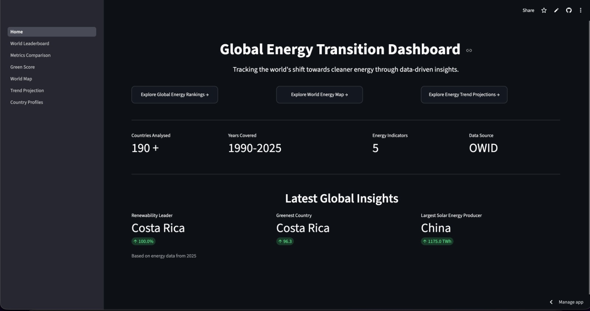
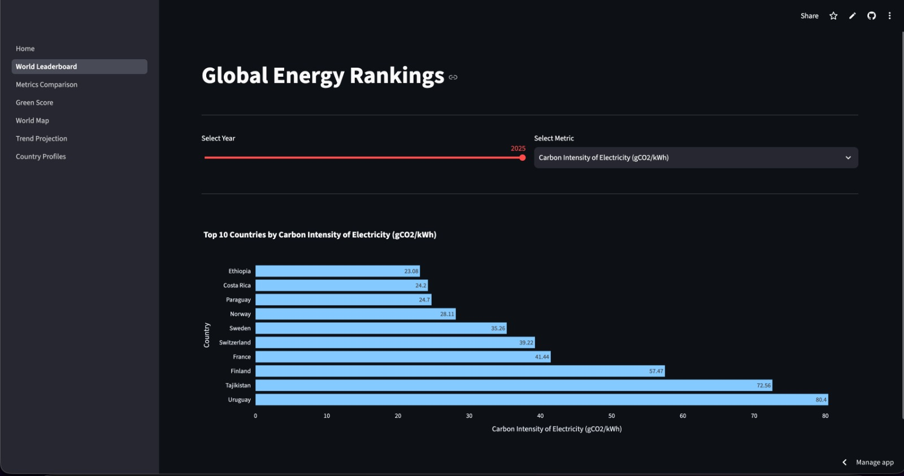
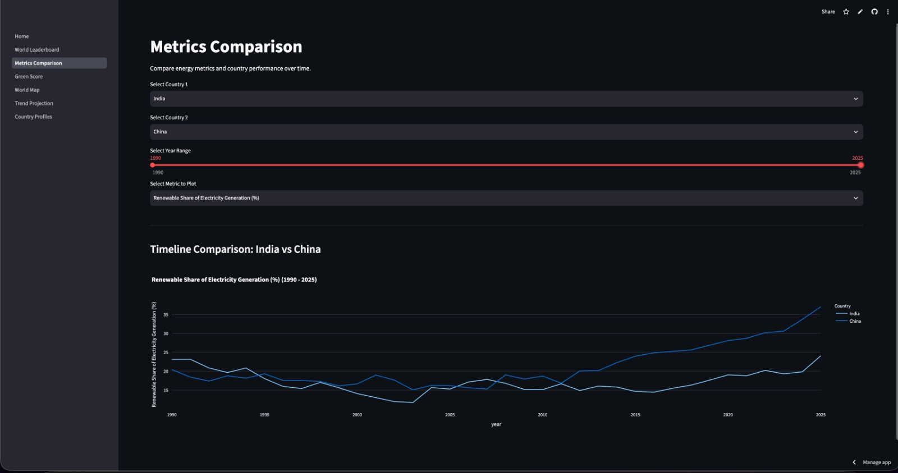
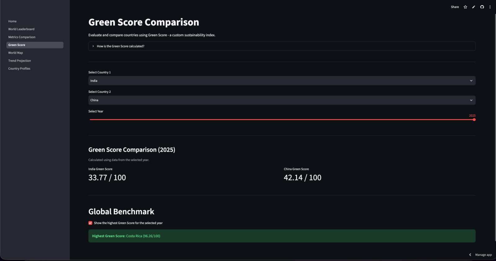
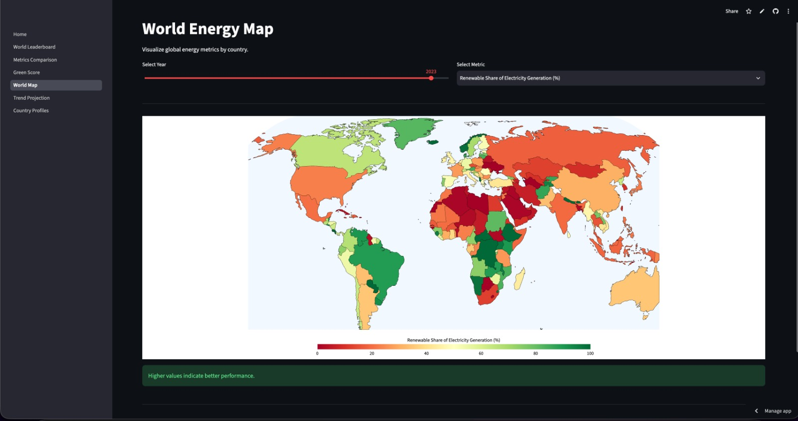
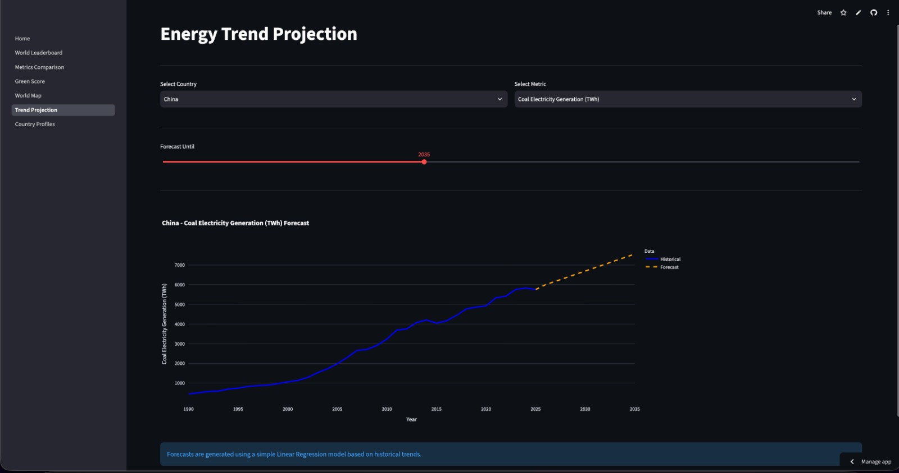
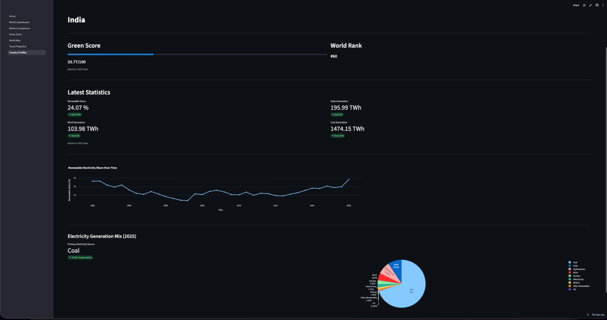

# Global Energy Transition Dashboard


An interactive **Streamlit dashboard** for exploring global electricity generation trends and energy transition progress using the **Our World in Data (OWID) Energy Dataset**.

The dashboard enables users to visualize global energy data, compare countries, explore historical trends, analyze renewable energy adoption, forecast future metrics, and evaluate a custom **Green Score** developed for this project.

---

# Live Demo

**Streamlit App**

> **https://global-energy-transition-dashboard.streamlit.app/**

**GitHub Repository**

> **https://github.com/Ag-8021/global-energy-transition-dashboard/**

---

# Demo

### Dashboard Walkthrough (MP4)

https://github.com/user-attachments/assets/77eaeca8-f21b-4ce4-a2f6-212b2a2d62e9

---

# Screenshots

| Home Dashboard | World Leaderboard |
|----------------|-------------------|
| |  |

| Metrics Comparison | Green Score |
|--------------------|-------------|
|  | |

| World Map | Trend Projection |
|-----------|------------------|
|  |  |

| Country Profile |
|-----------------|
|  |

---

# Key Highlights

- Interactive multi-page Streamlit dashboard
- Custom **Green Score** sustainability metric
- Global country rankings across multiple energy indicators
- Interactive world energy choropleth map
- Country-to-country metric comparison
- Country energy profile dashboard
- Renewable electricity trend visualization
- Electricity generation mix analysis
- Linear Regression based trend forecasting
- Modular Python codebase

---

# Features

## Home Dashboard

Provides a quick overview of the project through:

- Global KPIs
- Latest worldwide energy insights
- Navigation to all dashboard pages

---

## World Leaderboard

Ranks countries based on the selected energy metric.

Features:

- Year selection
- Metric selection
- Automatic ranking
- Handles both positive and negative sustainability metrics correctly
- Interactive Plotly horizontal bar chart

---

## Metrics Comparison

Compare two countries across any supported metric.

Features:

- Country selection
- Year range selection
- Metric selection
- Interactive Plotly line chart
- Dynamic comparison across historical data

---

## Green Score Comparison

A custom sustainability metric designed specifically for this project.

The score combines:

- Renewable electricity share
- Coal reduction
- Solar generation
- Wind generation
- Carbon intensity

Features:

- Compare Green Scores
- Select any year
- Identify the highest Green Score globally for that year

---

## World Energy Map

Interactive global energy visualization.

Features:

- Year selection
- Metric selection
- Country-wise choropleth visualization
- Automatic colour scaling depending on metric type
- Interactive hover information

---

## Trend Projection

Predict future energy trends using Machine Learning.

Features:

- Country selection
- Metric selection
- Forecast year selection
- Linear Regression forecasting
- Historical and predicted data displayed together

---

## Country Profiles

Detailed dashboard for an individual country.

Features:

- Green Score with animated progress bar
- Renewable electricity world rank
- Latest renewable share
- Solar generation
- Wind generation
- Coal generation
- Metric-wise rankings
- Renewable electricity trend
- Electricity generation mix
- Primary electricity source

---

# Tech Stack

| Category | Technologies |
|----------|--------------|
| Language | Python |
| Web Framework | Streamlit |
| Data Processing | Pandas, NumPy |
| Data Visualization | Plotly |
| Machine Learning | Scikit-Learn |
| Dataset | Our World in Data (OWID) |

---

# Dataset

This project uses the **Our World in Data Energy Dataset**.

Dataset Repository:

https://github.com/owid/energy-data

---

# Project Structure

```text
Global-Energy-Transition-Dashboard/

│
├── Home.py
├── constants.py
├── metrics.py
├── utils.py
├── requirements.txt
├── owid-energy-data.csv
│
├── assets/
│   ├── home.jpg
│   ├── leaderboard.jpg
│   ├── comparison.jpg
│   ├── green-score.jpg
│   ├── world-map.jpg
│   ├── trend-projection.jpg
│   ├── country-profile.jpg
│   └── demo.mp4
│
├── pages/
│   ├── 1_World_Leaderboard.py
│   ├── 2_Metrics_Comparison.py
│   ├── 3_Green_Score.py
│   ├── 4_World_Map.py
│   ├── 5_Trend_Projection.py
│   └── 6_Country_Profiles.py
│
└── README.md
```

---

# Green Score

The **Green Score** is a custom sustainability index (0–100) developed for this dashboard.

It combines five indicators:

| Component | Weight |
|-----------|---------:|
| Renewable Electricity Share | 50 |
| Coal Reduction | 20 |
| Solar Progress | 10 |
| Wind Progress | 10 |
| Carbon Intensity | 10 |

Higher scores indicate stronger progress towards cleaner electricity generation.

> **Note:** The Green Score is a custom metric created for comparative analysis within this project and is not an official sustainability index.

---

# Installation

Clone the repository

```bash
git clone <repository-url>
```

Move into the project directory

```bash
cd Global-Energy-Transition-Dashboard
```

Install dependencies

```bash
pip install -r requirements.txt
```

Launch the dashboard

```bash
streamlit run Home.py
```

---

# Future Improvements

Possible extensions include:

- Advanced forecasting models (ARIMA, Prophet, LSTM)
- Country profile comparison
- Additional sustainability indicators
- Regional filtering
- Export charts as images
- Animated historical map
- User-selectable forecasting algorithms

---

# Author

**Aarav Gupta**

GitHub: **https://github.com/Ag-8021/**

LinkedIn: **https://www.linkedin.com/in/aarav-gupta-733707421/**

---

# License

This project is licensed under the MIT License.
